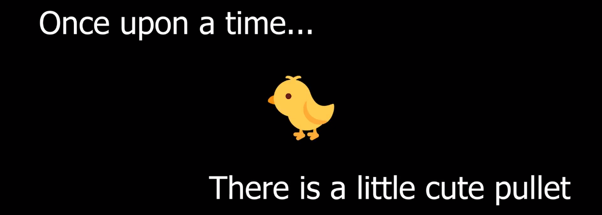
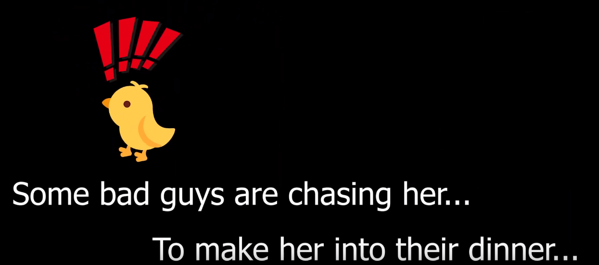
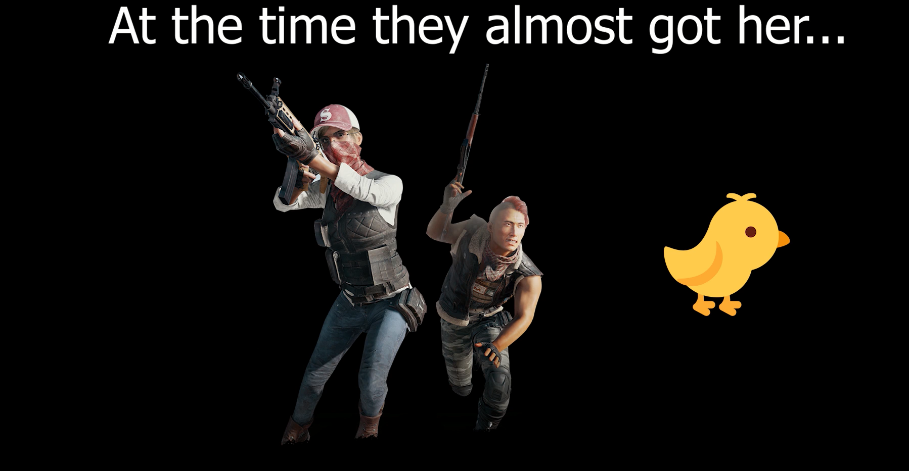
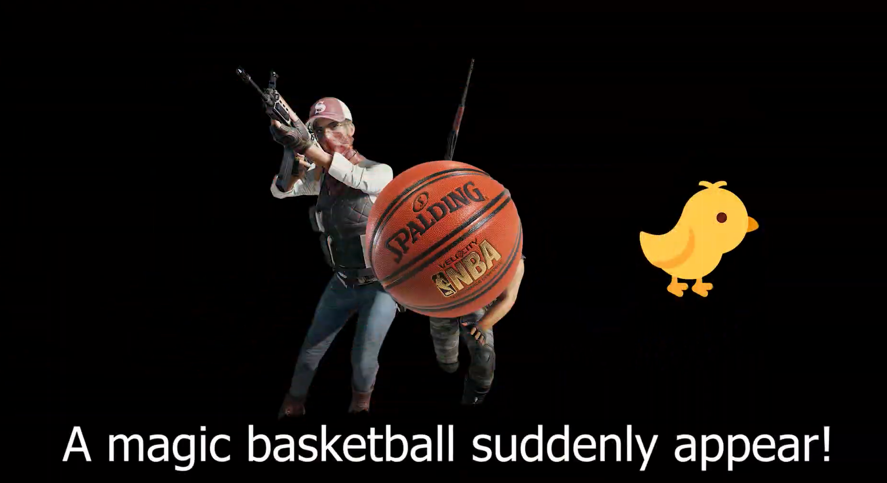
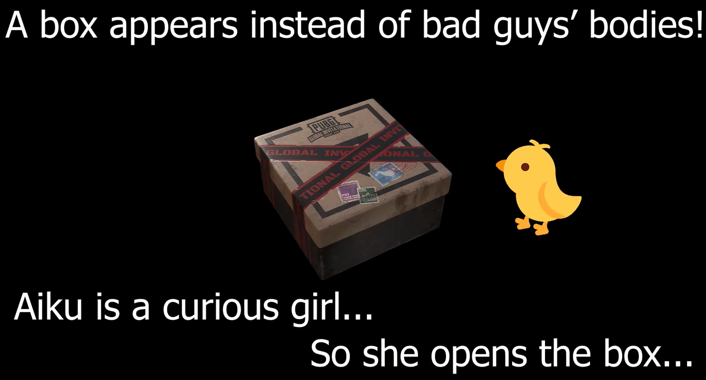
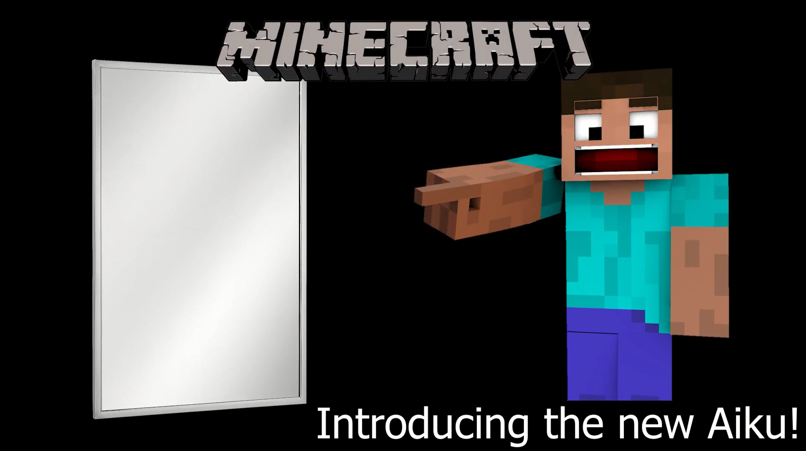
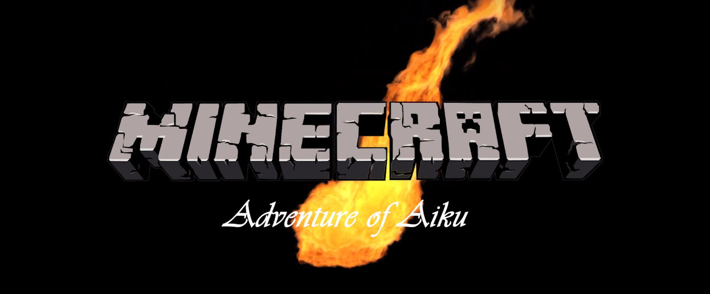

---
layout: default
title:  Home
---

Hello, welcome to our CompSci 175 AI Project - iKun AI's homepage!

Here is our cute agent's prototype Aiku! 

IKun AI is an Artificial Intelligence Project on Deep Q-Learning with Neural Network. The project is designed to let an agent play in a set of pre-built Minecraft 2D mazes. The agent is able to see the voxels in front of its sight, which is similar to what a normal player can see in Minecraft. The agent's goal is to get out of the maze as fast as possible using the limited resources that are given to the agent.

Our agent Aiku is a cute pullet good at singing, dancing, rapping and playing basketball. One day, she opened a box and she jumped into the Minecraft World. She was stuck in a very dangerous maze. Although with wieht the help of the force, a map appeaered in her thoughts, he doesn't know where she is in the map.

That is why we give her instructions by our intelligent algorithm with Deep Q-learning so that she can explore the maze firstly and guess exact location of her sight.

 

 

 

 

 

 

 

 

In this Minecraft World, Aiku finds herslef 
at somewhere of a maze. She receives a 
map of the maze from a mysterious person.
However, she does not know where exactly 
she is in the map, which means she needs 
to determine the position of herself in the 
map. Also, this maze is full of fatal flowing 
lava, so Aikun really wants herself to get 
out of the maze as fast as possible.
Here are some parameters of the maze, it 
is a 21 x 21 square. Aiku starts at 
a block called “emerald_block,” and ends at 
a block called “redstone_block.” Aiku is 
walking on diamond blocks. The environment
around her is extremely dangerous since
it is full of lava. What Aiku can do in one 
turn is either detect how many blocks in front
of her are walkable, turn left, turn right or 
move 1 block forward.
Since she already have the map, what she 
needs to do is just locate herself. After that, 
Aiku is smart enough to go to the ending 
block of the maze in the fastest path.

Source code: [https://github.com/yuexintonychen/iKun-AI](https://github.com/yuexintonychen/iKun-AI)

Reports:

- [Proposal](proposal.html)
- [Status](status.html)
- [Final](final.html)