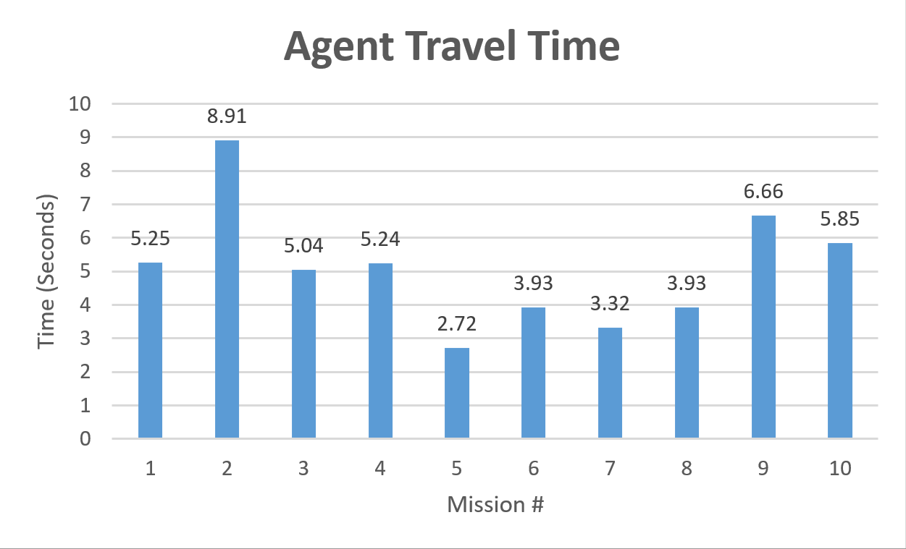
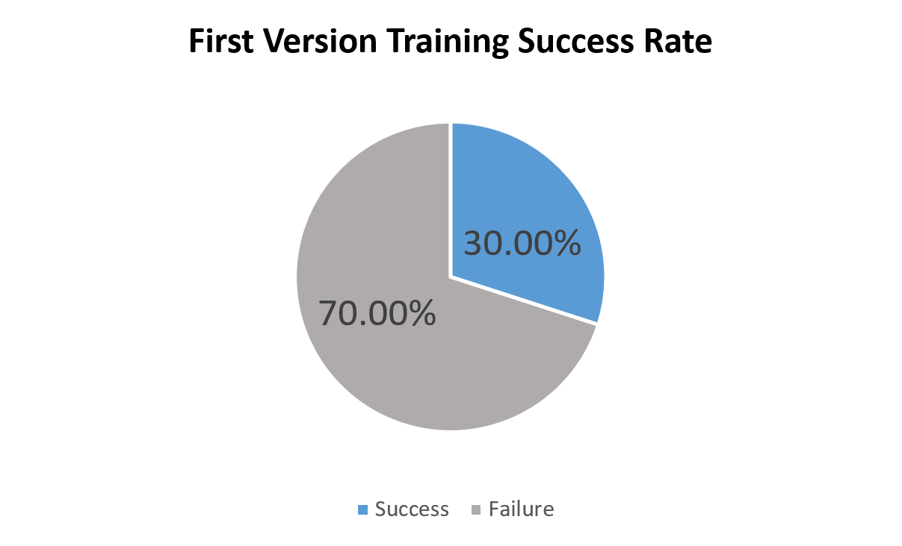

[Video Demo Link](https://www.youtube.com/watch?v=N5fgy7eh4qg&t=3s)

#### Project Summary
Our project makes use of Deep Q-Learning with Neural Network to let the agent find the shortest path between the source/starting block (unknown to the agent initially) and the destination block (unknown to the agent initially) in a pre-build 2D maze. The agent will be led to play in a set of pre-built Minecraft 2D mazes. The agent is able to see the voxels in front of its sight, which is similar to what a normal player can see in Minecraft (however, we might also change this to be a small range of voxels around the agent). The agent is given the full map of a maze, but it does not know source/starting block (the agent needs to locate itself on the map first) and the destination block (the agent needs to find its way out of the maze). The agent's goal is trying to locate itself first and then get out of the maze as fast as possible using the limited resources we have given to the agent. The final output (for each maze/test) is the starting block of the agent and a set of positions of blocks ordered by the path sequence found by the agent (if optimal, should be the shortest path between agent's starting block and the destination block).

#### Approach
In the project, we applied Bayesian filters to estimate the agent's location dependingon its observations and the actions. For the agent, at each time step $t$ it has four known parameters: the map information $M \times N$, the observation $s_{t}$, taken action $a_{t}$ and estimated position $y_{t}$.

In our algorithm, at every time step, the agent will update its estimated position $y_{t}$ by $Belief$. Belief function is $Bel(y_{t}) = p(y_{t}|s_{1:t-1}, a_{1:t-1},M)$ Specifically, at each time step $t$, the agent will guess its potential position according to the Belief function result. Then agent will combine $y_{t}$ with its observations $s_{t}$ to improve its current position accuracy. The formula $\overline{Bel} = Bel(y_{t}) \cdot Like(s_{t})$ is used to update belief position. $Like(s_{t}) $ is used to identify where's agent only depending on its current observation. 

$\overline{Bel}$ will give probability distribuition of every position in the map. The agent will take action $a_{t}$ given by the policy function $a_{t} = max(\pi(a_{t}|\overline Bel(y_{t}))$. The belief poistion at time $t+1$ is updated according to the action $a_{t}$ and the $y_{t}$. 
After taking several actions, the agent will give an estimated position with the maximun probability. 

The pre-trained model we used is based on the model in the Active Neural Localization project developed by Carnegie Mellon University Ph.D. student Devendra Chaplot. The base model were trained with Asynchronous Advantage Actor Critic (A3C) learning algorithm using Stochastic Gradient Descent with a learning rate of 0.001. The weight for entropy regularization was 0.01. The discount factor $\gamma$ for reinforcement learning was chosen to be 0.99. There were two sets of configuration of the model for 2D experiments and 3D experiments, respectively. Since we currently run our agent in all instances of 2D mazes, the pre-trained model under 2D experiments will be utilized. This model was trained with the use of multithreading (using torch.multiprocessing). The final data collected was the pre-trained model that has the best performance (accuracy) among all threads. Multiple training processes ran simultaneously when both training and testing. The pre-trained models are available for mazes with the size of 7, 15 and 21, with various lengths (agent's action number limit) of 15, 20, 30, 40, 60. Our demo uses size of 21 with length of 60 in this case to allow the agent perform the most actions with high accuracy.

#### Evaluation
For evaluation, we've run the agent with the A3C algorithm within a controlled set of mazes (with specified maze sizes and action limits). Specifically, the maze size is set as 21 (a 21x21 square maze), and the action limit is set as 60 (the max number of actions that the agent is allowed to play during a test is 60).

In order to evaluate the overall performance of our agent, we have collected the following categories of statistical data during the 10 tests: the number of actions the agent has taken during training (60 actions for each test), the time taken for fitting the maze map to the pre-trained model (during each test), the time taken for the agent to determine the shortest path from start to end after the agent determines its current position (using the pre-trained model, during each test) and the success/failure rate of the 10 tests.

 

Based on the training time graph, the aveage time taken for fitting the maze map to the pre-trained model among 10 tests is 1.70 seconds. The standard deviation is 0.17 seconds.

 

Based on the agent travel time graph, the aveage time taken for the agent to determine the shortest path from start to end after the agent determines its current position among 10 tests is 5.09 seconds. The standard deviation is 1.80 seconds.

 

According to the success/failure graph above, our agent current has an approximate success rate of 80% given a random maze with a specified maze sizes and action limits.

#### Remaining Goals and Challenges
Currently our agent's relies on the pre-trained models (within sizes of 7, 15, 21) provided in the Active Neural Localization project, limiting our agenet's capability of exploration and the variability of maze sizes. In the final stage, we plan to train our own models with dynamic sizes of 2D mazes. For moonshot cases, we plan to add monsters, traps to the mazes or even make the mazes be 3D, which significantly increases the complexity of the world for the agent to perceive. The agent carries a weapon that is a type of consumable, which can be used to fight against monsters. In the optimal scenario, the agent will reach the goal.
Also, if project Malmo allows, we will be optimizing the animations conducted by our agent (such as moving around and turning his/her orientation).

#### Resources Used
[Active Neural Localization](https://arxiv.org/pdf/1801.08214.pdf) 

[Asynchronous Methods for Deep Reinforcement Learning](https://arxiv.org/pdf/1602.01783.pdf) 

[PyTorch implementation of the ICLR-18 paper](https://github.com/devendrachaplot/Neural-Localization) 

[PyTorch implementation of Asynchronous Advantage Actor Critic (A3C)](https://github.com/ikostrikov/pytorch-a3c) 
